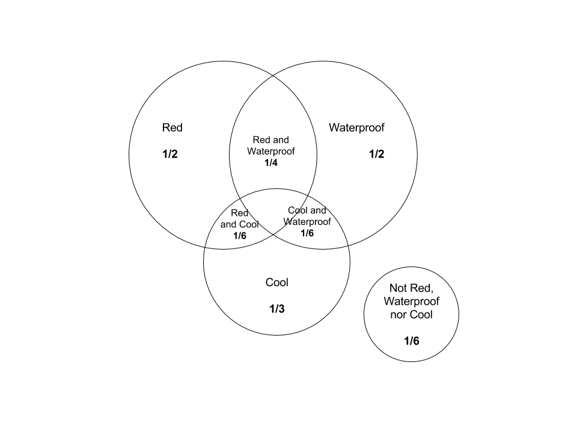

```{r setup, include=FALSE}
knitr::opts_chunk$set(echo = TRUE)
```

## 1. Gas Station Analytics

### (a) Probability that the next customer will request regular gas and fill the tank

* Probability that the next customer use reulgar gas: 40%
* Probability that will fill the tank: 30%

```{r 1-a}
(q1a <- 0.4 * 0.3)
```

12%

### (b) Probability that the next customer will fill the tank

#### Regular gas and fill the tank

* Probability that the next customer use reulgar gas: 40%
* Probability that will fill the tank: 30%

```{r 1-b-reg}
reg <- 0.4 * 0.3
```

#### Mid-grade gas and fill the tank

* Probability that the next customer use mid-grade gas: 35%
* Probability that will fill the tank: 60%

```{r 1-b-mid}
mid <- 0.35 * 0.6
```

#### Premium gas and fill the tank

* Probability that the next customer use premium gas: 25%
* Probability that will fill the tank: 50%

```{r 1-b-premium}
premium <- 0.25 * 0.5
```

```{r 1-b-sol}
(q1b <- reg + mid + premium)
```

45.5%

### (c) Conditional probability given the next customer fills the tank, they use regular gas

We know the probabilities of the next customer using regular gas and filling the tank and the total probability of the next customer filling the tank from (a) and (b).

```{r 1-c}
(q1c <- q1a/q1b)
```

26.4%

## 2. The Toy Bin

### (a) Area diagram representing events

* 1/2 are red
* 1/2 are waterproof
* 1/3 are cool
* 1/4 are red and waterproof
* 1/6 are red and cool
* 1/6 are waterproof
* 1/6 are neither red, waterproof, nor cool



### (b) Probability of getting a red, waterproof, cool toy

The probablity of getting a red, waterproof, cool toy is essentially the area of the intersection of the 3 circles Red, Waterproof and Cool. 

You can computer the area as follow:

1. Sum up the areas of the 3 circles (Red, Waterproof and Cool)
2. Subtract the sum of the intersections of the circles from #1
3. Subtract #2 from 1 then divide by 2

\[ \frac{1 - (\frac{1}{2} + \frac{1}{2} + \frac{1}{3} + \frac{1}{6} - (\frac{1}{4} + \frac{1}{6} + \frac{1}{6})))}{2} \]

```{r 2-b}
(1 - (1/2 + 1/2 + 1/3 + 1/6 - (1/4 + 1/6 + 1/6)))/2
```

\[ \frac{1}{24} \]

### (c) Conditional probability given the toy is red, it is not cool

* Probability that the toy is red: 1/2
* Probability that the toy is cool: 1/6

\[ P(Red|!Cool) = \frac{P(Red\cap!Cool)}{P(Red)} = \frac{\frac{1}{2} - \frac{1}{6}}{\frac{1}{2}} \]

```{r 2-c}
(1/2-1/6)/(1/2)
```

\[ \frac{2}{3} \]

### (d) Conditional probability given the toy is red or waterproof, it is cool

* Probability that the toy is red: 1/2
* Probability that the toy is waterproof: 1/2
* Probability that the toy is red and waterproof: 1/4
* Probability that the toy is cool: 1/3
* Probability that the toy is red and cool: 1/6
* Probability that the toy is red and waterproof: 1/6
* Probability that the toy is red, waterproof and cool: 1/24 (from b)

\[ P(Cool|Red \cup Waterproof) = \frac{P(Cool)}{P(Red \cup Waterproof)} = \frac{\frac{1}{6} + \frac{1}{6} - \frac{1}{24}}{\frac{1}{2}+\frac{1}{2}-\frac{1}{4}} \]

```{r 2-d}
(1/6+1/6 - 1/24)/(1/2+1/2-1/4)
```

\[ \frac{7}{18} \]

## 3. On the Overlap of Two Events

\[ P(A) = \frac{1}{2} \]
\[ P(B) = \frac{2}{3} \]

### (a) Maximum and minimum possible values for P(A AND B)

The maximum value would be when A and B completely overlap each other, which would simply be the value of P(A)

\[ Max P(A \cap B) = \frac{1}{2} \]

The minimum value would be when the overlap between A and B is the smallest.

```{r 3-a-min}
(1/2+2/3) - 1
```

\[ Min P(A \cap B) = \frac{1}{6} \]


### (b) Maximum and minimum possible values for P(A|B)

Again, the maximum value would be when A and B completely overlap each other.

\[ P(A|B) = \frac{P(A \cap B)}{P(B)} = \frac{\frac{1}{2}}{\frac{2}{3}} \]

```{r 3-b-max}
(1/2)/(2/3)
```

\[ Max P(A|B) = 3/4 \]

The minimum value would be when P(A AND B) is the smallest.

\[ P(A|B) = \frac{P(A \cap B)}{P(B)} = \frac{\frac{1}{6}}{\frac{2}{3}} \]

```{r 3-b-min}
(1/6)/(2/3)
```

\[ Min P(A|B) = 1/4 \]

## 4. Can't Please Everyone!

* Probability students like statistics given they have comleted w203: 3/4
* Probability students like statistics given they have not completed w203: 1/4
* Only 1 out of 100 Berkeley students completes w203

Probability of students who have completed w203 and like statistics

\[ \frac{1}{100} * \frac{3}{4} \]

```{r q4-w203}
w203_like_stats = 1/100 * 3/4
```

Probability of students who have not completed w203 and like statistics

\[ \frac{99}{100} * \frac{1}{4} \]

```{r q4-no-w203}
no_w203_like_stats = 99/100 * 1/4
```

Probability the student has completed w203 given they like statistics

\[ P(Student Completed W203|Student Likes Stats) = \frac{\frac{1}{100} * \frac{3}{4}}{\frac{1}{100} * \frac{3}{4} + \frac{99}{100} * \frac{1}{4}} \]

```{r q4-sol}
w203_like_stats/(w203_like_stats + no_w203_like_stats)
```

3%
