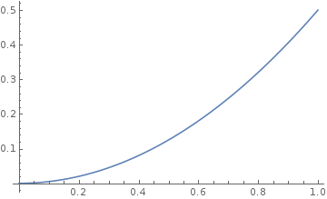
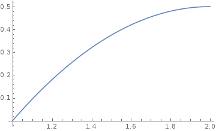

```{r setup, include=FALSE}
knitr::opts_chunk$set(echo = TRUE)
```

# The 'Pyramid' Distribution

## a. Find the cumulative density function of X, Fx, and plot it

\[ F(x) = \int_{-\infty}^xf(y)dy = \int_{0}^xydy = \frac{y^2}{2} |_{y=0}^{y=x} = \frac{x^2}{2} - 0 = \frac{x^2}{2}  \]



\[ F(x) = \int_{-\infty}^xf(y)dy = \int_{1}^x(2-y)dy = 2y-\frac{y^2}{2} |_{y=1}^{y=x} = 2x - \frac{x^2}{2} - (2 - \frac{1}{2}) = 2x - \frac{x^2}{2} - \frac{3}{2}  \]



## b. Compute E(X)

\[ E(X) = \int_{-\infty}^\infty xf(x)dx = \int_{0}^1 x*xdx = \int_{0}^1x^2dx = \frac{x^3}{3}|_{x=0}^{x=1} = \frac{1}{3} \]

\[ E(X) = \int_{-\infty}^\infty xf(x)dx = \int_{1}^2 (2-x)*xdx = \int_{1}^2 2x-x^2dx = x^2 - \frac{x^3}{3}|_{x=1}^{x=2} = 4 - \frac{8}{3} - (1 - \frac{1}{3}) = \frac{2}{3} \]

## c. Compute V(X)

\[ V(X) = E(X^2) - [E(X)]^2 \]

\[ E(X^2) = \int_{-\infty}^\infty x^2f(x)dx = \int_{0}^1 x^2*xdx = \int_{0}^1x^3dx = \frac{x^4}{4}|_{x=0}^{x=1} = \frac{1}{4} \]

\[ V(X) = \frac{1}{4} - (\frac{1}{3})^2 = \frac{5}{36} \]

\[ E(X^2) = \int_{-\infty}^\infty x^2f(x)dx = \int_{1}^2 x^2(2-x)xdx = \int_{1}^2(2x^2-x^3)dx = \frac{2x^3}{3}-\frac{x^4}{4}|_{x=1}^{x=2} = \frac{16}{3}-\frac{16}{4} - (\frac{2}{3} - \frac{1}{4}) = \frac{16}{12} - \frac{5}{12} = \frac{11}{12} \]

\[ V(X) = \frac{11}{12} - (\frac{2}{3})^2 = \frac{33}{36} - \frac{16}{36} = \frac{17}{36} \]

## d. Suppose Y(X) = X^2. Explain why Y is also a random variable

Y(X) is a function whose parameter is random variable X. This means the outcome of Y(X) depends on the value of the random variable X and therefore makes Y also a random variable.

## e. Compute E(Y)

\[ E(Y) = \int_{-\infty}^\infty h(x)f(x)dx = \int_{0}^1 x^2*xdx = \int_{0}^1x^3dx = \frac{x^4}{4}|_{x=0}^{x=1} = \frac{1}{4} \]

\[ E(Y) = \int_{-\infty}^\infty h(x)f(x)dx = \int_{1}^2 x^2(2-x)dx = \int_{1}^2 2x^2-x^3dx = (\frac{2x^3}{3} - \frac{x^4}{4})|_{x=1}^{x=2} = \frac{16}{3} - \frac{16}{4} - (\frac{2}{3} - \frac{1}{4}) = \frac{11}{12} \]
